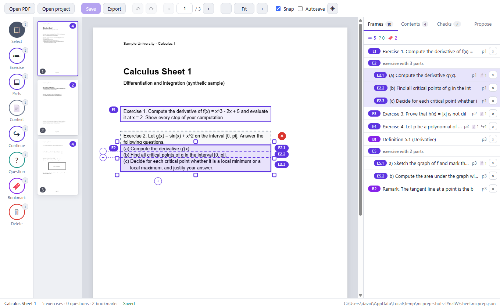

# Math Canvas Prep

Prepare a PDF once, on the desktop, and hand it to *Professor Euler: Math Canvas* ready to study: every exercise, part,
question and bookmark marked, the context that belongs to an exercise attached, and a table of contents. An AI agent does it
through a command line or an MCP server; a person does it in a desktop app that edits the same project file, so that the two can
work on one document. The result is a single **bundle** file (`.mcbundle`: the PDF plus its metadata) that the Android app
imports straight into its library.

A whole book (one with a free licence, say) can also be **audited once as an authority**: its exercises keep the numbers the
book prints (`5a`, `A.3`) inside the sections of the book, each is one exercise (never cut into parts), the answers of the
answer key at the back are attached as hidden solutions to grade with, and the licence and the notice travel with the file.
Chapter 14 of the [agent guide](docs/AGENT_GUIDE.md) describes it; a transcript of a whole audit is in
[examples/workbook/audit-session.md](examples/workbook/audit-session.md).



## Status

| Part | State |
| --- | --- |
| `packages/core` | Works. Model, rules, numbering, PDF reading and rendering, proposals, project file, bundle writer and importer check; authoritative book exercises, hidden solution regions, sections, document information (licence, notice) and the book summary. 598 tests. |
| `packages/cli` (`mcprep`) | Works. The whole workflow, `--json` everywhere, and the audit of a book: `exercises`, `solution`, `book` and `outline` commands. 69 tests, plus two end-to-end tests of the built binary. |
| `packages/mcp` | Works. 49 tools over stdio. 12 tests, plus an end-to-end test of the built server. |
| `apps/desktop` | Works on Windows (packaged and run). A visual editor with live reload of changes an agent makes to the file. 26 unit tests and 17 end-to-end tests that drive the built application. Not signed, no icon of its own, not tried on macOS or Linux: see [docs/DESKTOP.md](docs/DESKTOP.md). It has no screens yet for book exercises, solutions and sections: a project that has them still opens and saves, and the command line and the MCP server edit them. |
| Docs | [Agent guide](docs/AGENT_GUIDE.md), [CLI](docs/CLI.md), [MCP](docs/MCP.md), [desktop app](docs/DESKTOP.md), [project file](docs/PROJECT_FILE.md), [bundle format](docs/BUNDLE_FORMAT.md), [dependencies](docs/DEPENDENCIES.md). |

The bundle format ([docs/BUNDLE_FORMAT.md](docs/BUNDLE_FORMAT.md)) is the contract with the Android app; the writer and the
importer check implement every rule of it. Whether the Android app accepts a bundle made here has been checked against the
format's rules (the importer check) but not yet by importing one on a tablet. Version 0.2 of the tools writes the new optional parts
of the format (authoritative exercises, hidden solution regions, sections with ids, document information such as the licence);
an older reader ignores them and shows the exercises as ordinary ones.

## Quick start

You need Node 20.19 or newer.

```console
git clone https://github.com/dawei7/math-canvas-prep.git
cd math-canvas-prep
npm install
npm run build
```

`npm install` also downloads Electron's program file (about 100 MB); set `ELECTRON_SKIP_BINARY_DOWNLOAD=1` first if you only
want the command line and the MCP server.

### For an AI agent

Give the agent [docs/AGENT_GUIDE.md](docs/AGENT_GUIDE.md) (`npx mcprep guide` prints it) and either the command line or the MCP
server.

```console
npx mcprep init analysis.pdf --title "Analysis 1: Sheets" --folder "University/Analysis"
npx mcprep info
npx mcprep propose --ops batch.json      # offline heuristics, with their evidence; nothing is applied
npx mcprep frames apply batch.json       # one atomic batch, one validation
npx mcprep crop --all                    # PNGs of every frame: look at them
npx mcprep validate
npx mcprep export                        # analysis.mcbundle, checked as the Android importer would
```

Every command takes `--json`, never prompts and never uses the network. To register the MCP server in Claude Code, Claude
Desktop or another client see [docs/MCP.md](docs/MCP.md). A real session with every output is in
[examples/agent-session.md](examples/agent-session.md).

### For a person

```console
npm run desktop -- analysis.pdf          # or without a file name, for the welcome screen
```

Draw around the exercises (or press **Find proposals** and accept what is right), cut exercises into parts with the slicers,
check the **Checks** tab, press **Export**, and copy the `.mcbundle` to the tablet. [docs/DESKTOP.md](docs/DESKTOP.md) explains the
window. If an agent is marking the same PDF with the command line, its changes appear in the window as it saves them.

## What is in this repository

| Part | What it is |
| --- | --- |
| `packages/core` | The model, validation, numbering, text-line analysis, proposals, PDF reading and rendering, the project file and the bundle reader and writer. No UI. |
| `packages/cli` | `mcprep`, a command line for scripts and agents: inspect a PDF, add and edit frames, validate, render, export. |
| `packages/mcp` | An MCP server exposing the same operations as tools. |
| `apps/desktop` | The Electron app: a visual editor over the same project file. |
| `schemas/` | JSON Schemas of the manifest, frames, outline, project file and book summary. |
| `examples/` | A synthetic sample sheet, its project, its bundle and a transcript of marking it, and a synthetic workbook audited as an authority (`examples/workbook/`); `build-examples.mjs` rebuilds them. |
| `docs/` | The bundle format, the project file, the CLI, the MCP tools, the desktop app, the dependencies and the agent guide. |
| `.github/workflows/ci.yml` | Build, lint and tests on Linux and Windows. It publishes nothing and uses no secrets. |

## Three ways to mark a PDF

1. **On the fly, in the Android app.** Reading a PDF on the tablet, the learner can frame an exercise, cut it into parts, attach its
   context or bookmark a page at any moment. That stays a full feature of the app. These exercises are the learner's own: free,
   positional numbers (E1, E2.1).
2. **In advance, here.** When a whole book or an exam collection should be prepared efficiently, by hand or by an agent, these tools
   do it on a computer and write a bundle. Copy the bundle to the tablet and open it in the library.
3. **As an authority, here.** A book that is audited once keeps the numbers it prints (`5a`, `A.3`) inside its sections; each
   printed exercise is one exercise (never cut into parts, so `5a` and `5b` are two, with their shared statement as context), and
   the answers of its answer key are attached as hidden solutions. What this tool adds to a bundle is authoritative; what a learner
   adds in the app stays their own. See chapter 14 of the [agent guide](docs/AGENT_GUIDE.md).

## Privacy

PDFs and projects stay on your computer. The tools make no network calls when they run, have no telemetry and send nothing
anywhere (the desktop window enforces this: every request to the network is cancelled). The proposals are computed offline from
the printed text, not by an AI service. This repository contains no real textbooks or exams; its examples and test fixtures are
generated.

## Development

```console
npm run build        # TypeScript for the packages, the desktop app's bundles
npm test             # unit tests (Vitest, against the sources): 705 tests
npm run lint
npm run test:e2e     # the built binary, the MCP server over stdio and the desktop app (build first; the desktop test needs a display)
npm run docs         # regenerate docs/CLI.md and the tool reference of docs/MCP.md
npm run docs:licenses -- --write   # refresh the tables of docs/DEPENDENCIES.md
node examples/build-examples.mjs   # rebuild the examples after a build
npm run desktop      # start the desktop app from the checkout
npm run dist         # build, then package the desktop app (apps/desktop/release; unsigned)
```

## Licence

No licence has been chosen yet; until one is, all rights are reserved.
