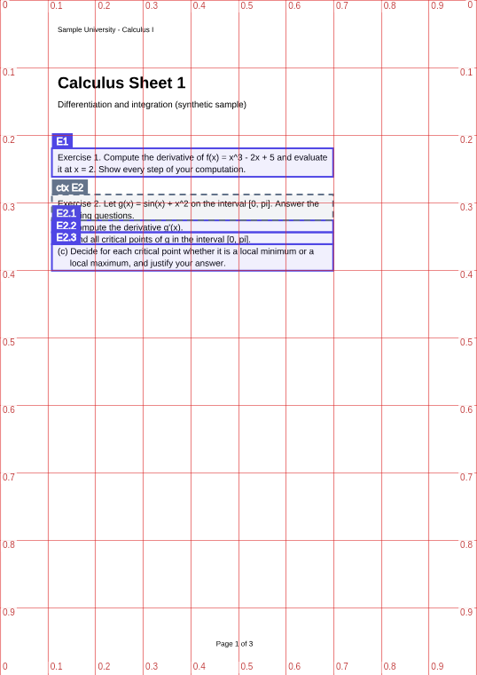

# Agent guide: marking a PDF for Math Canvas

This guide is for an AI agent that has to **mark a mathematics PDF** with Math Canvas Prep: find every exercise, cut exercises into
parts, attach the context they need, mark questions and bookmarks, check the result by looking at it, and export a bundle.
Read it once from top to bottom; the checklist at the end is for every PDF. (`mcprep guide` prints this text.) If the task is to
**audit a whole book as an authority** (exercises that keep the numbers the book prints, sections, answers from the answer key),
read chapter 14 as well: it replaces the free numbering of this guide with the book's own.

## 1. What you produce, and who uses it

You produce a **project** (`name.mcprep.json`, the work in progress, see [PROJECT_FILE.md](PROJECT_FILE.md)) and, at the end, a
**bundle** (`name.mcbundle`: the PDF plus `frames.json`, optionally `outline.json`, see [BUNDLE_FORMAT.md](BUNDLE_FORMAT.md)).

The bundle is imported by the Android app *Professor Euler: Math Canvas* into the learner's documents library. There the learner
opens the PDF and finds your marks as work items:

| Kind | What the learner does with it |
| --- | --- |
| **exercise** | Solves it by hand on a canvas; the app sends the framed region (and its context) to an AI for grading. |
| **exercise with parts** (a unit) | The same, once per part: (a), (b), (c) become 1.1, 1.2, 1.3, each with its own sheet and check. |
| **context** (attached to an exercise) | The instruction, question or background printed elsewhere. It is shown first when the exercise is shown and goes to the AI with every check. |
| **question** | A passage the learner wants to ask the AI tutor about. |
| **bookmark** | A place worth coming back to (a definition, a theorem, a worked example), with a sheet for the learner's own notes. Never graded. |
| **book exercise** (authoritative) | An exercise audited from a book once, named by the number the book prints (`5a`, `A.3`) inside its section. Never cut into parts, never renumbered; chapter 14. |
| **solution** (hidden, attached to an exercise) | A region of the same PDF (the answer key) used only to grade. The learner does not see it with the exercise. Chapter 14. |

Quality of marking decides quality of grading: a frame that cuts an exercise in half, includes the next exercise, or omits the
instruction makes the AI grade the wrong thing. That is why this guide insists on *looking at the result*.

Privacy: the PDF and the project never leave the machine. The tools make no network calls and send nothing anywhere; do not
upload the PDF anywhere either.

## 2. Install and register

From a checkout of the repository (Node 20.19 or newer):

```console
npm install
npm run build
npx mcprep help                      # the command line
node packages/mcp/bin/mcprep-mcp.js  # the MCP server (stdio), see MCP.md for registering it in your client
```

Everything below uses the command line; the MCP tools have the same names and arguments (`docs/MCP.md`). Every command takes
`--json` (one JSON document on standard output, never a prompt) and returns an exit code: **0** success, **2** you used the command
wrongly, **3** a file cannot be used, **4** the request is understood but the data is not acceptable (the JSON error has a
`code` and a `hint`). The full reference is [CLI.md](CLI.md).

## 3. The coordinate system

> **Pages are zero-based. Positions are fractions of the page as displayed, origin at the top-left, y grows downwards.**

- `page: 0` is the first page. A 42-page PDF has pages 0 to 41. The printed page numbers in the book are something else again.
- A rectangle is `{ "left", "top", "right", "bottom" }`, each between 0 and 1, `left < right`, `top < bottom`. On the command line:
  `--rect left,top,right,bottom`.
- Fractions are of the page **as displayed**, that is after the page's own `/Rotate`. A page rotated by 90 degrees that shows as
  landscape has `x` along its long side. `mcprep info` prints the size and the rotation; images from `render` are displayed pages.
- Not percent, not PDF points. `10,20,90,30` is an error; `0.10,0.20,0.90,0.30` is right.
- A frame must be at least `0.02` wide and `0.01` tall. One line of text on a normal page is about `0.015` tall.

### A worked example

The synthetic sample page is A4: 595 x 842 points. `mcprep lines 0` lists the text lines:

```text
top-bottom     left-right     size  col  text
0.2257-0.2403  0.121-0.6876   11    0    Exercise 1. Compute the derivative of f(x) = x^3 - 2x + 5 and evaluate
0.2433-0.2579  0.121-0.5161   11    0    it at x = 2. Show every step of your computation.
0.2942-0.3088  0.121-0.6702   11    0    Exercise 2. Let g(x) = sin(x) + x^2 on the interval [0, pi]. Answer the
```

- The text of exercise 1 starts 72 pt from the left edge: `72 / 595 = 0.121`. Its first line spans from `190.0 pt` to
  `202.3 pt` from the top: `190.0 / 842 = 0.2257`, `202.3 / 842 = 0.2403`.
- On the rendered image `page-0.png` (1131 x 1600 pixels) the same corner is at pixel `(137, 361)`: `137 / 1131 = 0.121`,
  `361 / 1600 = 0.2256`. With `--grid 0.1` the lines of the grid are labelled with page coordinates, so you can read `0.2` and
  `0.3` off the picture and interpolate.
- In a **crop** the labels are still page coordinates. If the crop is `w` x `h` pixels and the result's `view` is
  `{ left, top, right, bottom }`, then a pixel `(px, py)` is the page position
  `(left + px / w * (right - left), top + py / h * (bottom - top))`.
- The frame for exercise 1 is `0.109,0.2197,0.6997,0.2619`: a little above its first line (`0.2257 - 0.006`), a little below its
  last line (`0.2579 + 0.004`), and as wide as the text block plus a margin of `0.012` on each side.



## 4. The workflow

1. **Create the project.** `mcprep init book.pdf --title "Analysis 1: Sheets" --folder "University/Analysis"`. The folder is where
   the app files the document (names separated by `/`, at most seven levels). Everything else uses the project in the current
   folder; give `--project <file>` when there are several.
2. **Inspect.** `mcprep info`: page count, sizes, `/Rotate`, whether the pages have a text layer, the PDF's own outline. A page
   **without** a text layer is a scan: see section 8.
3. **Look at a few pages.** `mcprep render 3 --grid 0.1` writes a PNG; open it. Read the layout: one column or two, where the
   headers and footers are, how exercises are numbered, whether there are figures.
4. **Propose.** `mcprep propose` prints exercise starts with *evidence*, the part markers inside them, instructions printed for
   several exercises, and definitions as bookmarks. It is a heuristic starting point, not the truth. For a big PDF write the
   proposals as operations: `mcprep propose --ops batch.json`, read and edit `batch.json`.
5. **Apply in one batch.** `mcprep frames apply batch.json` applies all operations atomically with one validation at the end.
   If anything is wrong nothing is written and the error names the operation (`Operation 7 (split): ...`).
6. **Look at every frame.** `mcprep crop --all` writes one PNG per frame (and per context and continuation region). **Open them
   and look.** Section 7 says what to check. Fix with `frames update`, `frames split`, `frames dividers`, `context add`, ...
7. **Validate.** `mcprep validate`: errors must be zero; read the warnings (section 9).
8. **Contents.** If the PDF has bookmarks: `mcprep outline pdf --adopt` copies them into the project so that they are exported.
   If not: `mcprep outline derive` finds headings by size, bold and numbering; check them and `--apply`, or write your own with
   `mcprep outline set outline.json`.
9. **Export.** `mcprep export` writes `name.mcbundle` next to the project and reads it back with the importer's checks.
   `mcprep import-check name.mcbundle` repeats that check on any bundle.
10. **Tell the user** where the bundle is and what to know (section 10).

A real session on the sample, with every output, is in [`examples/agent-session.md`](../examples/agent-session.md).

### Working next to a person

The person may have the same project open in the desktop app ([DESKTOP.md](DESKTOP.md)). That changes nothing for you: keep
using the commands (or the MCP tools).

- Every command writes the project atomically under a lock, so the window never sees a half-written file. It shows what you
  changed within a second or two and marks it as "updated by an agent". The person can review page 3 while you work on page 30.
- If the person has unsaved edits when you save, the window asks them which version to keep: you cannot lose their edits and
  they cannot silently lose yours.
- Say what you changed (pages, counts, what you were unsure about): the window only says that something changed.
- Do not try to operate the window; everything it can do is a command. Do not edit `name.mcprep.json` by hand with a text tool
  unless you have to: the commands validate, lock and keep the file consistent.

The window knows the **two kinds of exercise** of chapter 14, so a person and an agent can share a book:

- A book exercise you add (`exercises add`) shows in the window with its **printed label** (`5a`, never an `E` number), grouped by
  section, in amber with square labels; the exercises the person frames themselves stay `E1`, `E2.1`, ... and are not renumbered by
  yours. Leave their ordinary exercises alone unless asked: `exercises mark` and `exercises unmark` change a kind, and the person
  can do the same from the card of a frame (a part of an exercise with parts has to be joined first, as for you).
- The person can **draw** a book exercise (the window asks for its number and section and offers the next number in the section),
  change its label or section, attach **context** and **solution** regions (the solutions are drawn on the answer key, in green),
  and add, rename, move or delete **sections**. Every one of those is the operation you know (`label.set`, `section.set`,
  `solution.add`, `outline.update`, ...), so your next `exercises list`, `book show` or `solution list --missing` already reflects
  it, and a section id they renamed keeps its exercises. Read before you assume ids and labels, and say which sections or labels
  you are going to touch.
- What the person draws but has not confirmed yet (the form that waits for a number) is not in the file, so you cannot collide
  with it. A change of yours that makes the person's unsaved edit conflict asks them which version to keep, as above.
- The person sees your sections as a tree with the number of book exercises under each and how many have a solution: the same
  counts as `book show`. A section with no `id` cannot hold exercises, and the window says so; give ids (`outline ids`).

## 5. Deciding what to mark

### Exercises

An **exercise frame** contains the exercise's number and statement and everything up to **but not including** the next exercise's
number. It does not contain page headers, footers or page numbers, and not a section heading that follows it.

- **Start** a little above the line that carries the number: `top = line.top - 0.006`, but never inside the line above (if that
  line is closer than `0.006`, start at its bottom). `--snap` does this for you when your rectangle cuts through lines.
- **End** just above the next exercise's start, or, for the last one on a page, a little below its last line (`+ 0.004`). The
  exercise **includes its figure or table**, so extend the bottom over it; it may include a short answer space but need not.
- **Width**: the text block, with a margin of about `0.012`. Use the same `left` and `right` for all frames on a page: parts of one
  exercise must have the same left and right anyway.
- An exercise is the unit the learner solves. Do not mark a whole page or a whole section as one exercise, and do not mark a
  *heading* ("Chapter 3 Exercises") as one.
- Frames of independent exercises must not overlap each other. A frame inside another frame is a warning.

### Exercises with parts

When an exercise has parts (a), (b), (c) that the learner answers separately, mark it as **one exercise cut into parts**. The parts
share a `unit`, always **tile one area** (each part starts exactly where the one above ends, same left and right), and are numbered
by the app as `4.1`, `4.2`, `4.3`.

- **Each part starts at its marker line**: `(a)`, `a)`, `a.`, `(i)`, `1)`, `3.1` ... `mcprep propose` finds them; `mcprep lines` lets
  you check. Put the divider a little above the marker line (`line.top - 0.006`, or at the bottom of the line above it).
- **Where does the shared statement go?** The text before (a) ("Let f be ... Answer the following") is needed by *every* part.
  There are two conventions:
  - *The app's own splitter* (the "parts" button on the tablet) keeps it inside the **first** part: part 1 starts at the top of the
    frame. That works when a person frames on the tablet, but part 2 and 3 are then graded without the statement.
  - **Recommended for bundles: make it context.** The first part starts at the marker of (a), and the text above it (the exercise
    number and the shared statement) becomes **context of the exercise**, which the AI receives with *every* check:
    `mcprep frames split f1 --first 0.3265 --at 0.3441,0.3617 --preamble context --snap`, where `--first` is the top of the
    (a) line and `--at` the tops of (b) and (c). `mcprep propose` produces exactly this (`--parts context` is the default;
    `--parts keep` gives the app's convention).
- If an exercise has **no statement before (a)** (the marker is on the exercise's first line), the first part starts at the top of the
  frame and there is nothing to make context.
- Only one level of parts. If (a) has sub-items (i), (ii), keep them inside part (a).
- A part that is a single line is fine (the minimum piece is `0.01`).
- To change parts later: `frames dividers <part> --at y1,y2` (move/add/remove the cuts), `frames area <part> --rect l,t,r,b` (move
  or resize the whole exercise), `frames merge --unit <unit>` (back to one frame), `frames delete <unit> --unit`.
- A part cannot be moved or resized on its own (`frames update` refuses with `E_UNIT_PART`): the parts always tile.

### Context

**Context** is the instruction, question or background that belongs to an exercise but is printed elsewhere. Attach it with
`mcprep context add <exercise> --page <n> --rect l,t,r,b --snap`; at most 8 regions per exercise; only exercises have context. For an
exercise with parts it is kept on the first part and applies to all parts.

- An instruction printed once above several exercises ("Exercises 3 and 4: justify every answer") is context of **each** of them:
  add the same region to both. `mcprep propose` finds these ("applies to p3, p4").
- A statement, a definition of the function, or a figure on **another page** that the exercise refers to ("see Figure 2") is context
  too, with the page of that place.
- Do not put context inside the exercise's own frame (the warning `context-overlaps-frame` says the text would be shown twice).
- Do not use context for things the learner does not need to solve this exercise.

### Questions and bookmarks

- A **bookmark** marks a place worth keeping: a definition, a theorem with its statement, a worked example, a table of formulas.
  Frame the whole block (title and statement), not just the title line. `propose` suggests blocks that start with
  Definition, Theorem, Lemma, Proposition, Corollary, Remark, Example (and German/French/Spanish forms).
- A **question** marks a passage the learner wants to ask the AI tutor about. The learner decides that, so create questions
  when the user asked for them or told you what is confusing; do not invent them.
- Neither has parts or context. A question or bookmark may have `continues` regions.

### Tasks that continue on the next page or in the next column

If an exercise starts at the bottom of a page and goes on at the top of the next, make **one** frame for the part where it starts and
attach the rest as **continuation regions**: `mcprep continues add f4 --page 3 --rect l,t,r,b --snap` (up to 8, in reading order).
`propose` does this when the next page starts with text that is not a new exercise. The next page's own exercises are separate
frames; do not let the continuation region cover them.

An **exercise with parts cannot have continuation regions.** If its parts run over a page break, make each page's parts frames of the
same unit: parts (a) and (b) at the bottom of page 3, part (c) at the top of page 4 are three frames with the same `unit`; the
tiling rule applies per page.

### Layouts that need care

- **Two columns.** `mcprep lines` reports a `column` for every line; a frame covers one column. An exercise that flows from the
  bottom of the left column to the top of the right one is a frame plus a continuation region. Numbering is by page, then `top`,
  then `left`, exactly as the app does it, so in a two-column layout the numbers can differ from the printed order: the labels that
  `frames list` shows are the ones the app will show.
- **Figures.** Include a figure that belongs to the exercise inside its frame (extend the bottom edge). A figure printed at the top
  of the next page that the exercise refers to is context.
- **Rotated pages.** Nothing special: all coordinates are of the displayed page (`info` shows `/Rotate`).
- **Very short exercises.** A frame must be at least `0.02` wide and `0.01` tall; a smaller rectangle is enlarged around its centre
  (with a note), `--no-enlarge` refuses instead. One text line is about `0.0146` tall on A4; a one-line exercise frame with padding is
  about `0.02`.
- **Solutions and answer keys.** Do not mark solution pages as exercises unless the user wants them as bookmarks.

## 6. How to find where an exercise starts and ends

With a text layer, work from `mcprep lines <page>`:

1. Find the lines that begin an exercise: "Exercise 3", "Aufgabe 3", "Problem 3", "3.", "3)", "Task 3", ...
   (`propose` lists them with a confidence and its reasons; trust it where it says 0.9 and look hard where it says 0.5).
2. `top` = `line.top - 0.006`, or the bottom of the line above if that is closer.
3. `bottom` = the `top` of the next exercise's start (computed the same way), or for the last exercise on a page the bottom of its
   last text line plus `0.004`; over a figure if there is one (render the page and look).
4. `left` / `right` = the text block (smallest `left` and largest `right` of the body lines, minus/plus `0.012`).
5. Add it with `--snap` and read the notes; then look at the crop.

Without a text layer, see section 8.

### Proposals for books

For a textbook that is audited once as an **authority** (exercises that keep the numbers the book prints, sections for its
contents, the answer key as hidden solution context; see [BUNDLE_FORMAT.md](BUNDLE_FORMAT.md) section 3 and chapter 14 below) three
commands do what `propose` does for a sheet. The whole workflow, for a person and for an agent, is in
[AUDIT_A_BOOK.md](AUDIT_A_BOOK.md); this is how they work and what to check.

**`outline derive --book`** reads three things the book prints about its structure and cross-checks them: the printed contents
(lines with dot leaders and a page number; lines that the text extraction merged are cut apart again, also a page number glued to the
next label), the list of sections printed on each chapter opener, and the headings on the pages (a chapter opener "Chapter 3", a small
label line "3.2" above a large heading, "3.2 Practice - Title"). Printed page numbers are mapped to pages through the page numbers in
the footers. It proposes chapters (`id` `c3`, `label` `Chapter 3`) and sections (`id` = `label` = `3.2`) with title, zero-based page,
`top` (where the label line is), a confidence and the evidence, and for each section where its practice set starts and ends (where the
next section, the next chapter or the answer key starts). Titles are normalised ("&" and a slash between words read as "and", numbering
and leaders removed); where the contents has a typo that the opener list and the headings contradict, the majority wins and the
evidence says so; spellings that differ are listed. A book without numbered sections falls back on generic headings (ids made from
the titles) and then has no practice sets to read. `--apply` stores the entries as the outline of the project (`outline.set`), which
replaces the outline it had.

**`exercises propose`** finds, in each practice set, the lines that start with a printed number (`5)`, `5.`, `(5)`, `5a)`; also a
number alone on its line beside a figure, glued to the text, or without its closing mark when the sequence asks for it), keeps those
whose numbers form a sequence and that align like the others (an indented line inside a paragraph that starts with a number is put
aside, with its reason), and reports gaps, duplicates and stray numbers instead of hiding them. The page is cut into bands by the bold
instructions and each band into columns by the left edges of its items, so a page with two columns in one group and three in the next
is read correctly, also when the extraction merged the two items of a row into one line. Everything that belongs to an item goes into
its frame: continuation lines, the rows of a fraction or a root, the labels of a figure, the figure itself (from the ink profile) and the
lines on the next page (a continuation region). The bold instruction above a group is the `context` of every item below it, also when
it crosses a page break (two regions); a practice set without an instruction gives no context. `--apply` adds the exercises as
book exercises in one atomic batch (`add` with `authority`, `label`, `section`, `context`, `continues`, `solution`); they are named
`SECTION:LABEL` (`0.1:5`). It can be run again: an exercise the project has exactly like this is skipped, one that only lacks its
answer gets the answer, one that differs (you corrected the frame) is kept and listed under `changed`, and `--replace` overwrites it in
place (it keeps its id). `--dry-run` shows the batch and its validation without writing.

**`solutions propose`** cuts the answer key into bands by the small section markers and the headers (a band runs across all columns
and over page breaks), reads the answers of a band with the same engine (a number that stands alone with a graph below it, an answer of
several lines, a fraction) and matches them by (section, label) to the authoritative exercises of the project. `--apply` gives each
exercise its answer with `solution.set` (one operation per exercise, named `SECTION:LABEL`), under the same rules as above
(`changed`, `--replace`).

Limits, and what to look at:

- **A garbled text layer.** A glyph that the PDF sets at an absurd size (an unmapped "not equal" sign at 120 points) is read at the
  usual size of the page. A line that is garbled in some other way can still swallow the lines around it into one of unreadable
  text: the exercises or answers inside are missing and show up as gaps and as "no answer for ...": frame those by hand (`add` with
  `authority`, `label` and `section`) after looking at the page.
- **What the book itself gets wrong:** a number printed twice, a missing answer, a practice set with more exercises than the contents
  promise. The proposal follows the print; what to do with the difference is for the owner of the audit to decide (`--max-items` caps a
  section).
- **Parts** ((a), (b)) are not split into exercises of their own: they stay inside the exercise that carries the number.
- **Figures and graphs** are framed with the ink profile, which cannot tell which column a drawing belongs to (a figure stops at the
  column to its right and above a heading): look at every kind of figure item and at graph answers.
- **Edges** move into the white between two lines when the page's ink map says that an edge runs through a glyph; in rows that are set
  very tight there may be none within reach of the own text. `scripts/acceptance-book.mjs` counts such regions (see AUDIT_A_BOOK.md).
- **Without font information** (pages read without `--fonts`) instructions are found by their position only.

Check by looking, as in section 7, in a sample that covers every kind of layout: the first and the last item of every section, an item
beside a figure, an item at the end of a page, an instruction that crosses a page break, a two-column row with fractions, a
three-column row, a graph answer, an answer of several lines, the last answer before a chapter heading. `mcprep crop 0.1:5` crops a
book exercise by section and label, `--region context:0` shows the instruction and `--region solution:0` the answer. Read the `notes`
of the commands and the gaps before you look at any crop. Fix with the operations you know: `update` for a rectangle, `context.set` for
the instruction, `solution.set` for an answer, `delete` and `add` (with `--replace` for an exercise that exists) for an exercise that
was found where there is none or not found.

## 7. Check by looking

`mcprep crop --all` (or `mcprep crop f3`, `mcprep crop --page 2 --rect l,t,r,b`) writes PNGs. Open each and check:

- [ ] The number and the first words of the exercise are at the **top**; the previous exercise's last line is not.
- [ ] The **last line** of the exercise is at the bottom, complete; nothing of the next exercise is below it.
- [ ] **No line of text is cut in half** at the top or bottom (a sliver of a line above or below means the edge is wrong: move it
      or use `--snap`).
- [ ] No **page header, footer or page number** is inside.
- [ ] The **figure** or table of the exercise is inside.
- [ ] For parts: each crop begins with its marker `(b)`; the statement is in the context crop (`crop f2 --region context:0`).
- [ ] A continuation crop (`--region continues:0`) starts where the text goes on and ends before the next exercise.
- [ ] A bookmark contains the whole block, title and statement.

`mcprep render 3 --frames --grid 0.05` draws all frames of the page with their labels (E1, E2.1, Q1, B1; dashed = continuation or
context) on the page: use it to see the whole page at once and to find overlaps and gaps. After a fix, look again.

## 8. Scanned PDFs, and pages without a text layer

`info` lists pages without a text layer; `lines` returns nothing for them; `propose` says there is nothing to propose and `--snap`
cannot do anything. You mark by eye:

1. `mcprep render <page> --grid 0.05` and open the image.
2. Read the positions of the top of the exercise number, the top of the next exercise and the margins off the labelled grid
   (interpolate between grid lines).
3. Put the edges in the white space between items, not inside text: a little (about `0.005`) above the first line, a little below
   the last.
4. `mcprep frames add --kind exercise --page <n> --rect l,t,r,b`, then `mcprep crop <id> --grid 0.02` and check as in section 7.
   Expect to correct once or twice. Use `frames update <id> --rect ...` with the corrected values.

Mixed documents are common (typeset pages and scanned pages): `propose` works on the pages that have text and tells you the rest.

## 9. Validation

`mcprep validate` applies every rule of the bundle format and says which frame is wrong and how to fix it:

- **Errors** are what the importer would reject; the bundle cannot be exported until they are gone. Typical: a page that does not
  exist (`page-out-of-range`), a rectangle too small or outside the page, parts of a unit with a gap or overlap (`unit-gap`,
  `unit-overlap`), parts that are not in one column (`unit-edges`), context on a question, more than 8 regions.
- **Repairs** are fixed silently by the importer (and by the exporter): a value a hair outside the page, parts that miss each other
  by less than `0.002`.
- **Warnings** are allowed but suspicious: `overlap` and `contained` (independent frames), `thin-frame`, `clips-line` (an edge cuts
  through a line of text), `includes-header-footer`, `context-overlaps-frame`, `unit-single`, `no-frames`. Fix them unless you
  have a reason.

The extra rules about book exercises, sections and solutions (and their codes) are in 14.6.

A command that would introduce an error is refused (`E_REJECTED`, exit code 4) and writes nothing; `--force` writes anyway (do not,
unless you intend to fix it in the next command). `--dry-run` previews any change.

## 10. Export, and what to tell the user

```console
mcprep export                 # sheet.mcbundle next to the project; use --out to choose
mcprep import-check sheet.mcbundle
```

The exporter validates, writes atomically and reads the bundle back with the importer's own checks; a bundle that fails them is
removed. The result lists repairs and warnings. `import-check` also refuses what the app refuses in a bundle the exporter would
never write, for example an upper-case hash, a manifest that names another entry than `document.pdf`, `frames.json` or
`outline.json` (or an `outline.json` the archive does not have), a folder that is not text, a JSON entry that is not UTF-8, a
stored entry that has its size after its data, an entry whose name has a `..` segment, a leading `/` or a backslash. Then tell
the user, briefly:

- the **path** of the bundle and the project, and that the bundle goes to the tablet and is opened in the Math Canvas library;
- how they can **review** your marking by eye: `npm run desktop -- name.mcprep.json` opens the project in the editor, where every
  frame can be moved or corrected by hand (then export again from there, or with `mcprep export`);
- the **counts**: exercises (parts counted once), parts, questions, bookmarks, contents entries;
- what you were **unsure** about (low-confidence proposals, ambiguous layouts), the pages **without a text layer**, anything left
  out on purpose, and any warnings you accepted;
- that the numbering shown by the tools (`E4.2`) is computed by position, as the app does.

## 11. What not to do

- Do not use one-based page numbers, percent or points.
- Do not guess the numbers the app will show: it numbers by position. Use ids (`f3`) to refer to frames and `frames list` to see labels.
- Do not let independent frames overlap, and do not cut a line of text in half.
- Do not include page headers, footers and page numbers; do not mark headings as exercises; do not mark a whole page.
- Do not put the shared statement of an exercise with parts into a *second* part, or leave it out of every part and context.
- Do not give an exercise with parts a `continues` region, and do not try to move one part alone.
- Do not trust `propose` blindly: look at the crops.
- Do not edit the PDF, and do not copy the PDF into other places than the bundle. Do not upload anything.
- Do not mark questions the user did not ask for.
- Do not export with errors by forcing: fix them.
- Auditing a whole book as an authority has rules of its own (labels as printed, no parts, sections, hidden solutions): 14.7.

## 12. Recipes

### A whole sheet in one batch

The operations are the same as the commands; `"ref"` names a frame you just made so that later operations can say `"@name"`
without guessing generated ids. This batch marks the second page of the sample: an instruction that is context of two exercises, an
exercise that continues on the next page and a definition as a bookmark.

<!-- test:batch -->
```json
{
  "operations": [
    { "op": "add", "ref": "ex3", "kind": "exercise", "page": 1, "rect": [0.109, 0.2435, 0.7187, 0.2857] },
    { "op": "add", "ref": "ex4", "kind": "exercise", "page": 1, "rect": [0.109, 0.7423, 0.7187, 0.8021],
      "continues": [ { "page": 2, "rect": [0.109, 0.0962, 0.7033, 0.1208] } ] },
    { "op": "context.add", "id": "@ex3", "page": 1, "rect": [0.109, 0.1128, 0.7187, 0.1727] },
    { "op": "context.add", "id": "@ex4", "page": 1, "rect": [0.109, 0.1128, 0.7187, 0.1727] },
    { "op": "add", "kind": "bookmark", "page": 2, "rect": [0.109, 0.196, 0.7033, 0.2558] }
  ]
}
```

Operations: `add`, `update`, `delete`, `move`, `split`, `merge`, `dividers`, `area`, `context.add`, `context.remove`, `context.set`,
`continues.add`, `continues.remove`, `outline.set`, `outline.add`, `outline.clear`, `meta.set`, and for books (chapter 14)
`authority.mark`, `authority.unmark`, `label.set`, `section.set`, `solution.add`, `solution.remove`, `solution.set`,
`outline.update`, `outline.delete`, `outline.ids`. Their fields are the options of the
matching commands (`mcprep help frames split`, ...). Apply with `mcprep frames apply batch.json` (or `-` for standard input);
`--dry-run` first if you like.

### An exercise with parts and the shared statement as context

```console
mcprep lines 0                       # find the tops of "(a)", "(b)", "(c)" lines
mcprep frames add --kind exercise --page 0 --rect 0.109,0.2882,0.6996,0.4010 --snap
mcprep frames split f1 --first 0.3265 --at 0.3441,0.3617 --preamble context
mcprep crop f1 --region context:0    # the number and the shared statement
mcprep crop f1                       # starts at (a)
```

### A textbook chapter of 40 pages

```console
mcprep init chapter.pdf --title "Analysis: Chapter 3" --folder "University/Analysis"
mcprep info
mcprep render 5 --grid 0.1                   # understand the layout first
mcprep propose --pages 0-9 --ops first.json  # try ten pages, read first.json, check the evidence
mcprep frames apply first.json
mcprep crop --all                            # look; fix what is wrong
mcprep propose --pages 10-39 --ops rest.json
mcprep frames apply rest.json
mcprep outline pdf --adopt                   # or: outline derive --apply
mcprep validate && mcprep export
```

Marking the first ten pages first shows how well the heuristics fit this book before you apply them to all of it.

### A scanned sheet

```console
mcprep info                                   # "text layer: MISSING on pages 0-3"
mcprep render 0 --grid 0.05
mcprep frames add --kind exercise --page 0 --rect 0.08,0.12,0.92,0.31
mcprep crop f1 --grid 0.02                    # look, then adjust:
mcprep frames update f1 --rect 0.08,0.115,0.92,0.305
```

### Errors you will meet

| You see | It means | Do |
| --- | --- | --- |
| `E_PAGE` | The page does not exist (or you used a one-based number). | Pages are zero-based: `info` says how many there are. |
| `E_RECT_RANGE` | Values outside 0..1: percent or points. | Divide by the page width (x) or height (y). |
| `E_RECT_ORDER` | `right <= left` or `bottom <= top`. | Origin is the top-left; y grows downwards. |
| `E_REJECTED` | The change would introduce validation errors. | Read the issues; fix; or `--dry-run` to see them. |
| `E_UNIT_PART` | You tried to move one part alone. | `frames area`, `frames dividers`, `frames merge`. |
| `E_SPLIT` | A divider leaves a piece thinner than `0.01`, or is outside. | Choose dividers inside the frame, at least `0.01` apart. |
| `E_PDF_CHANGED` | The PDF is not the one the project was made for. | Restore it, `relink`, or start a new project. |
| exit code 3 | A file is missing or damaged, or another program holds the lock. | Read `error.message` and `hint`. |

## 13. Checklist

- [ ] `info`: pages, rotation and text layer understood; pages without text noted.
- [ ] A few pages rendered with `--grid` and looked at.
- [ ] Every exercise marked once, starting at its number and ending before the next; headers and footers left out.
- [ ] Parts where the exercise has (a), (b), (c); the shared statement is context; parts start at their marker lines.
- [ ] Instructions printed once for several exercises attached as context to each; context from other pages attached.
- [ ] Tasks that continue have continuation regions (or parts per page for a unit).
- [ ] Definitions, theorems and worked examples worth keeping are bookmarks; questions only where asked.
- [ ] Every frame **looked at** in `crop --all`; nothing cut in half, nothing missing, nothing extra.
- [ ] `validate`: zero errors, warnings understood.
- [ ] Contents: PDF bookmarks adopted, or derived and checked, or written by hand.
- [ ] `export` done and `import-check` says it would be accepted.
- [ ] The user is told where the bundle is, the counts, the uncertainties and the pages that need a look.

## 14. Auditing a book as an authority

Chapters 1 to 13 are about exercises a person frames for themselves: their numbers are free and positional (`E1`, `E2.1`),
they can be cut into parts, and they change when a frame is added before them. This chapter is about the other kind: a
book (usually one with a free licence) that is **audited once, on a computer, and then offered to many learners as an
authority**. Every exercise of such a book has an address that never changes: the number the book prints. You produce that
address, the sections the book is divided into, the context each exercise needs and the answer it is graded against.

### 14.1 Two kinds of exercise

| | Ordinary exercise | Authoritative (book) exercise |
| --- | --- | --- |
| Who makes it | A person, for themselves (in the app or with `frames add`). | You, auditing the book (`exercises add`). |
| Number | Positional, computed (`E4.2`), renumbered when frames are added. | The **label** the book prints (`5a`, `12`, `A.3`), stored, never renumbered. |
| Where | Anywhere on the pages. | In a **section** of the book (an outline entry with an id). |
| Parts | Can be cut into parts (`frames split`): units. | **No parts.** `5a` and `5b` are two exercises with two labels. |
| Name in commands | The frame id (`f12`). | The frame id, or `SECTION:LABEL` (`1.2:5a`). |
| In the file | no `authority` | `"authority": "book"`, `label`, `section` |

Rules that follow from the difference, and that the tools enforce:

- **One exercise per printed item.** The printed exercise "5. Compute: (a) 3 + 4, (b) 7 - 2" is **two** book exercises, `5a` and
  `5b`, each framed on its own part. Never cut a book exercise into parts: `frames split`, `dividers`, `area` and `merge`
  refuse it (`E_AUTHORITY`), and a book exercise cannot have a `unit`.
- **The statement they share is context.** The text "5. Compute:" is attached as `--context` to **both** `5a` and `5b`. Context
  is what the learner sees with the exercise and what the AI receives with every check. Give each part only what it needs.
- **The label is what the book prints**, without the closing `.` or `)`: the book prints "5." or "5)" and the label is `5`; part
  (a) of exercise 5 is `5a`; an appendix exercise "A.3" is `A.3`; "II-4" is `II-4`. 1 to 24 characters: a letter or digit first,
  then letters, digits, spaces and `. _ - ( ) /`. **Never make a label up** and never number by position: if the book skips
  numbers, so do you. A label with the dot still on it is accepted but warned about (`label-style`): the importer, the exporter and
  the commands all drop it, so `5.` is `5` (and `5` and `5.` in one section are the same exercise).
- **The pair (section, label) is unique.** A book that starts again at 1 in every practice set needs one section per set. Adding
  an exercise that exists is an error (`E_DUPLICATE_EXERCISE`), so that applying the same batch twice does no harm.
- **Context is not solution.** *Context* (`--context`) is the instruction, shown to the learner and sent to the AI. *Solution*
  (`--solution`, `solution add`) is a region **of the same PDF**, typically the answer key at the back, that **only the grader**
  receives: hidden from the learner, never shown with the exercise, never sent to a tutor chat. A solution printed in another
  file or on a web page is outside the format: leave it out.
- Questions and bookmarks stay what they are; a document may mix book exercises with exercises a person added.

### 14.2 Sections are the outline

The sections are the entries of the document's contents (the outline), exactly as in a table of contents: chapters, then the
sections in them. An entry that exercises are filed under has an **id** (`1.2`, `c3`: letters, digits, `. _ -`, unique), may
have the printed **label** (`1.2`, `Chapter 3`) and the **top** of its heading on its page (0 to 1) so that two sections on one
page can be told apart. A section runs from its heading to the next heading of the same or a lower depth.

```console
mcprep outline pdf --adopt          # the book's own bookmarks as the outline (or: outline derive --apply, or outline set outline.json)
mcprep outline ids                  # give every entry an id: its printed label, else the number in its title
mcprep outline                      # ids, labels, tops and the number of exercises under each entry
mcprep outline update 1.2 --top 0.12 --label 1.2   # fix a heading's position or label
mcprep outline add --title "Review exercises" --page 31 --depth 1 --id review --label R
```

- Choose sections the way the book numbers its exercises: if every practice set starts at 1, each set is a section; if numbering
  runs through a chapter, the chapter is the section. An exercise is filed under the **deepest** entry it is printed in.
- Entries without an id cannot hold exercises. `outline set outline.json --auto-ids` writes a whole outline with ids in one go.
- `section-mismatch` warns when an exercise is printed in another section than the one it is filed under: look at the page, then
  either `exercises section <frame> <id>` or correct the heading's `page` and `top`.
- Renaming an id (`outline update 1.2 --new-id subtracting`) takes the exercises along; a section with exercises cannot be
  deleted (`E_SECTION_IN_USE`).

### 14.3 The workflow, in order

1. **Create the project and look.** `mcprep init book.pdf --title "Pre-Algebra" --folder "Books/Algebra"`, `mcprep info`, then
   `mcprep render <page> --grid 0.1` on a few pages: where do the chapters start, how are exercises numbered, where is the
   answer key (page numbers of the **PDF**, zero-based, not the printed ones).
2. **Say what the book is.** `mcprep book meta --author "A. Author" --series "Prerequisites" --license-name "CC BY 3.0"
   --license-url https://creativecommons.org/licenses/by/3.0/ --source-url https://example.org/the-book --notice @notice.txt`.
   Copy the licence and the attribution **exactly** from the book's own front matter or licence page; never invent them. A licence
   that asks for attribution travels with the bundle, and the app shows the notice.
3. **Sections.** Adopt or write the outline, give it ids (14.2), and check it against the page images.
4. **Exercises, section by section.** Find where each printed exercise starts and ends exactly as in chapters 5 and 6 (start a little
   above the line that carries the number, end before the next number, figures inside, no headers or footers), then
   `mcprep exercises add --section 1.2 --label 5a --page 17 --rect 0.09,0.41,0.91,0.48 --snap --context 17:0.09,0.36,0.91,0.41`.
   A task that goes on over the page: `--continues <page>:l,t,r,b`. For a whole section write one batch (`mcprep frames apply
   batch.json`, one atomic call with one validation; each operation `{ "op": "add", "authority": "book", "section": "1.2",
   "label": "5a", "page": 17, "rect": [..], "context": [..], "solution": [..] }`); the `ref` and `@name` mechanism of 12 works too.
   (For a whole book, steps 3 to 5 can start from the proposals of section 6 and docs/AUDIT_A_BOOK.md: `outline derive --book --apply`,
   `exercises propose --solutions --apply`; then look at the result and correct it with the commands below.)
5. **Solutions.** Find each answer in the answer key and attach it: `mcprep solution add 1.2:5a --page 211 --rect
   0.1,0.52,0.5,0.54 --snap`, or pass `--solution 211:l,t,r,b` to `exercises add`. One small region per exercise (the line
   "22) 0"), or one block for several exercises: give each the same region. Exercises the key does not answer simply have none
   (`mcprep solution list --missing` lists them; they are not an error).
6. **Look at everything.** `mcprep crop --all --section 1.2` writes one PNG per region: the exercise, its continuations, its
   context and its solution. `mcprep render 211 --frames --solutions` draws the labelled exercises and the solution regions on a
   page. Open the images (14.4). For a whole book that is too much: `mcprep exercises verify` checks every region against the text
   layer without images (a region that does not start with its number, an answer that holds another number, regions that lie on each
   other, numbers missing or out of order; every error is a defect, run it until it has none), and `mcprep exercises sample --crops
   sample/` names a fixed sample to look at, the same for every agent: the first and the last exercise of every section, every kind of
   layout the book has, a spread of the rest, and their answers (docs/AUDIT_A_BOOK.md has the rules and the table of findings).
7. **Validate.** `mcprep validate`: zero errors; read every warning (14.6).
8. **Compare with the book.** `mcprep book show` lists the sections with the number of exercises in each, how many have a
   solution, and the first and last label (`1 .. 24`). Does the last label match the last number printed in that section? Are
   numbers missing that the book does print? `mcprep exercises list --section 1.2` and `mcprep solution list --missing` find them.
9. **Export.** `mcprep export` (the bundle carries the sections, the exercises, the hidden solutions and the book's
   information), `mcprep import-check book.mcbundle`, `mcprep inspect-bundle book.mcbundle`, and `mcprep book export --out
   book.book.json` for the plain JSON summary of the sections with their counts (format: `mcprep schema book-summary`).
10. **Tell the user** the path of the bundle and the project, the number of sections and of exercises (and how many have a
    solution), what the licence and notice say, the sections or pages you were unsure about, and the numbers the book skips.

The MCP tools have the same names as the commands: `exercises_add`, `exercises_list`, `solution_add`, `book_show`, `book_meta`,
`outline_add`, `outline_ids`, ... and `apply_operations` takes the same batch.

### 14.4 What to check by looking at the crops

- [ ] The exercise crop starts with the **number the book prints**, and that is the label you gave it (`5a` starts at "(a)").
- [ ] Nothing of the next exercise is at the bottom, no line is cut in half, no running header or footer is inside, the figure is inside.
- [ ] For `5a` and `5b` the **context** crop shows the shared statement ("5. Compute:") on **both**, and the exercise crops do not repeat it.
- [ ] The **solution** crop shows the answer to **this** label (not its neighbour's), complete, and not the next answer. In a dense key
      make the region as small as the answer line, or use one block for exercises that share it.
- [ ] A continuation crop starts where the text goes on and ends before the next exercise.
- [ ] On the page image (`render --frames --solutions`) the labels run in the order of the book and no exercise is missing or twice.

### 14.5 Changing things, and running things twice

- `exercises label <frame> <label>`, `exercises section <frame> <section>`: change the number or the section. A label that is taken in
  the section is refused naming both exercises. A batch may swap two labels: duplicates are judged once, at the end.
- `exercises mark <frame> --label 5a --section 1.2` turns an exercise a person framed into a book exercise (it must not be part of a
  unit: `frames merge --unit` first); `exercises unmark <frame>` turns it back into an ordinary one.
- `frames update <frame> --rect ...` moves or resizes a book exercise (not `area`); `context add/remove`, `continues add/remove`,
  `solution add/remove/clear` change its regions; `frames delete <frame>` removes it.
- **Applying the same batch twice does not duplicate anything**: the second time is an error naming the first exercise
  (`E_DUPLICATE_EXERCISE`) and nothing is written. To redo exercises on purpose add `"replace": true` (`--replace`): the exercise
  keeps its frame id; page, rect and continuation are replaced; context and solution are replaced when you list them (an empty list
  clears them) and kept otherwise.
- A change that would break the book (an exercise left without a section, a duplicate label) is refused as a whole; `--dry-run`
  shows the issues, `--force` writes anyway (do not).

### 14.6 Rules and errors that come with books

| You see | It means | Do |
| --- | --- | --- |
| `E_AUTHORITY` | You tried to cut, resize as parts or merge a book exercise, or to make a question authoritative. | One exercise per printed item; context for what they share (14.1). |
| `E_AUTHORITY_UNIT` / `authority-unit` | A book exercise was made part of a unit. | Frame each printed item on its own: no `unit`. |
| `E_LABEL` / `bad-label`, `label-missing` | The label is empty, too long or uses characters the format does not allow. | The number as the book prints it: `5`, `5a`, `A.3`. |
| `E_SECTION` / `bad-section`, `section-missing` | The section is not an id. | The id of an outline entry (`mcprep outline`). |
| `section-unknown` | The section is not the id of any outline entry (or the project has no outline). | `outline add`/`outline ids`, or `exercises section`. |
| `duplicate-exercise` / `E_DUPLICATE_EXERCISE` | Two exercises are the same (section, label). | A label of its own, or delete the copy, or `--replace`. |
| `solution-not-exercise`, `too-many-regions` | A solution on a question or bookmark, or more than 8 regions. | Solutions only on exercises; merge neighbouring regions. |
| `E_SOLUTION` | A solution operation that cannot work (no such region, more than 8). | `solution list` shows the indexes. |
| `outline-bad-id`, `outline-duplicate-id`, `outline-bad-label`, `outline-bad-top` | An outline entry's id, label or top is wrong. | `outline update`. |
| `E_SECTION_IN_USE` | A section with exercises cannot lose its id or be deleted. | Move the exercises first (`exercises section`). |
| `E_OUTLINE_MODE` | `export --outline pdf` or `none` with book exercises. | Export with the project's own outline (the default). |
| `E_META` / `info-bad-url`, `info-too-long` | The author, licence, address or notice cannot go into a bundle. | `http(s)` addresses, texts within the limits. |
| `label-style` (warning) | The label ends with the `.` or `)` the book prints after the number (the importer drops it), or has stray spaces. | `exercises label <frame> 5`. |
| `section-mismatch` (warning) | The exercise is printed in another section than the one it is filed under. | `exercises section`, or correct the section's `page` and `top`. |
| `solution-overlaps-frame`, `solution-is-exercise` (warnings) | The solution region lies on the exercise itself, or is another exercise's region. | Point it at the answer key. |

### 14.7 Do not

- Do not number exercises by position, make labels up, or "tidy" the book's numbers (`1a` stays `1a`, a skipped number stays skipped).
- Do not cut a book exercise into parts, give it a `unit`, or put the statement of `5a` into `5b`'s frame instead of context.
- Do not put the answer key in `context` (the learner would see it) and do not put an instruction into `solution` (nobody would see it).
- Do not attach solutions from another file or from the web, and do not guess an answer region: look at the key.
- Do not invent the licence, the author or the notice, and do not drop the notice the licence asks for.
- Do not rebuild the outline with `outline set` once exercises exist without keeping the ids they name.

### 14.8 Checklist for a book

- [ ] `book meta`: author, licence name and address, source address and the notice the licence asks for, copied from the book.
- [ ] Outline = the sections of the book, every entry that holds exercises has an id; headings with `top` where two sections share a page.
- [ ] Every printed exercise is one book exercise with the label the book prints, in the section it is printed in; parts are separate
      exercises with the shared statement as context; continuations attached.
- [ ] Every answer of the key is attached as a solution to its exercise; the exercises without one are known.
- [ ] Every region **looked at** (`crop --all --section ...`): exercise, context, continuation, solution.
- [ ] `validate`: zero errors, warnings understood; `book show` compared with the book; `export` and `import-check` done.
- [ ] The user is told where the bundle is, the counts per section, the licence, and what you were unsure about.
