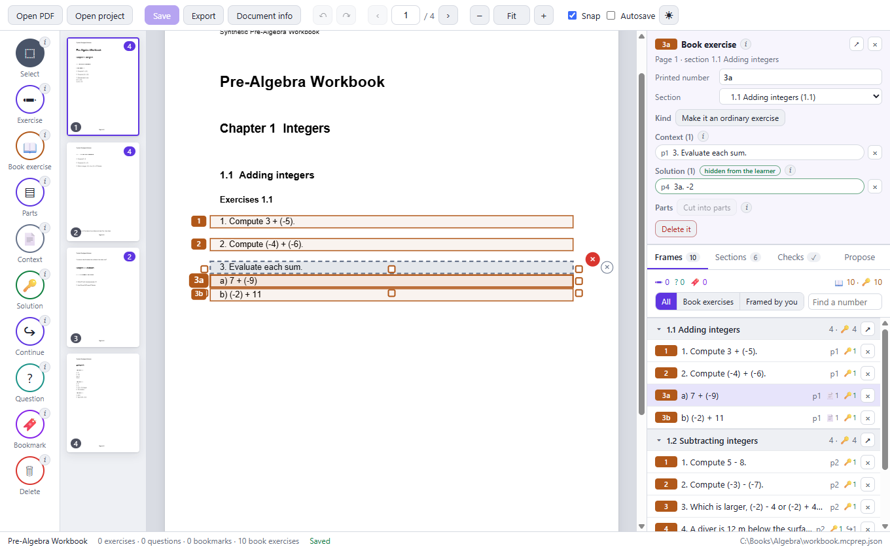
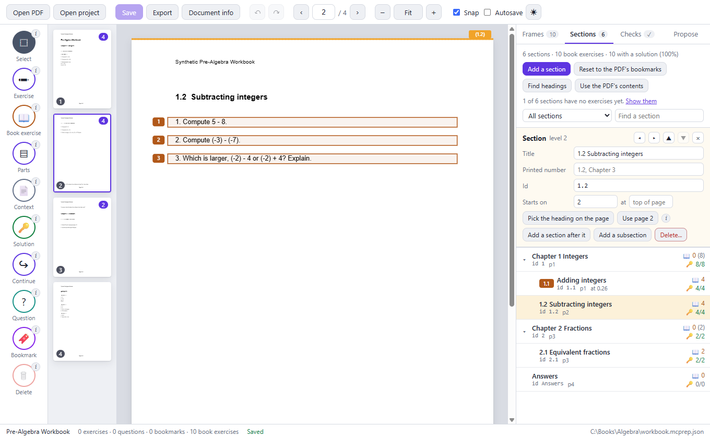
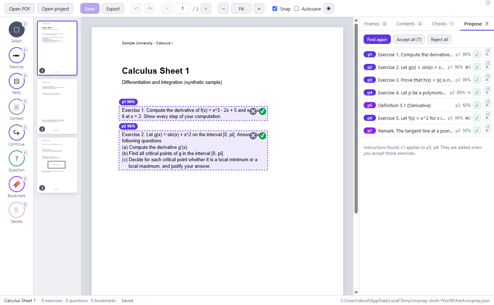
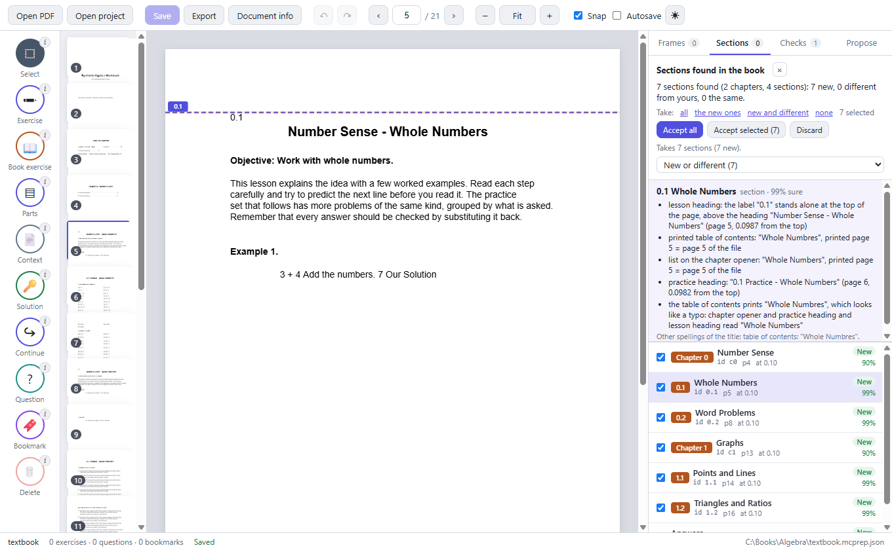
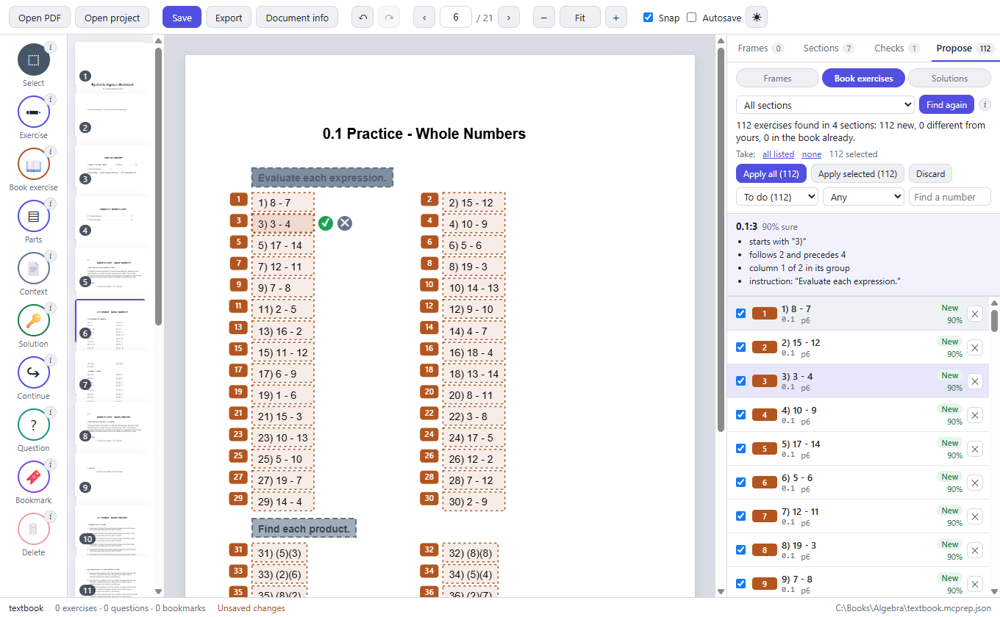
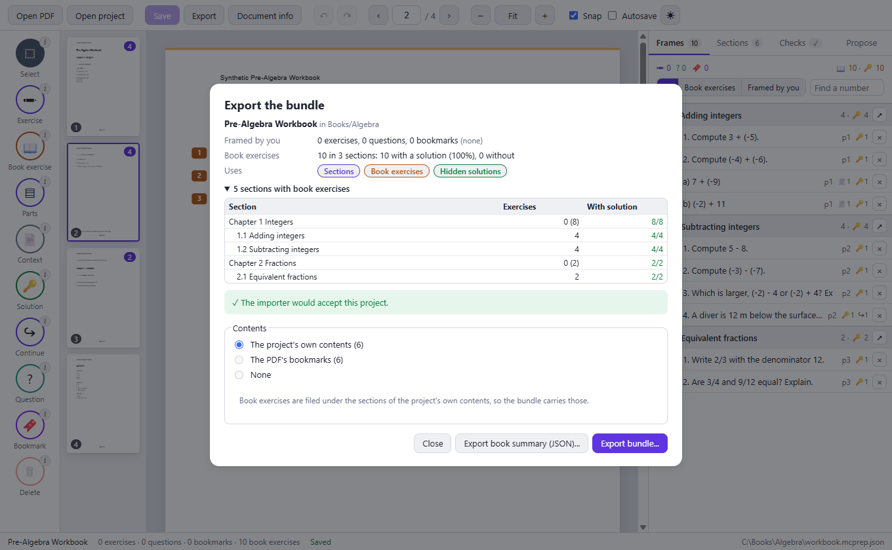
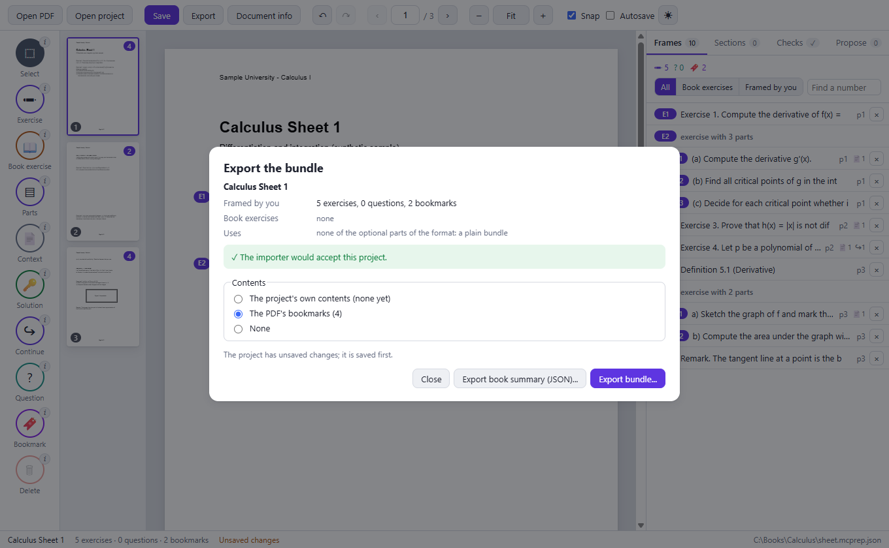
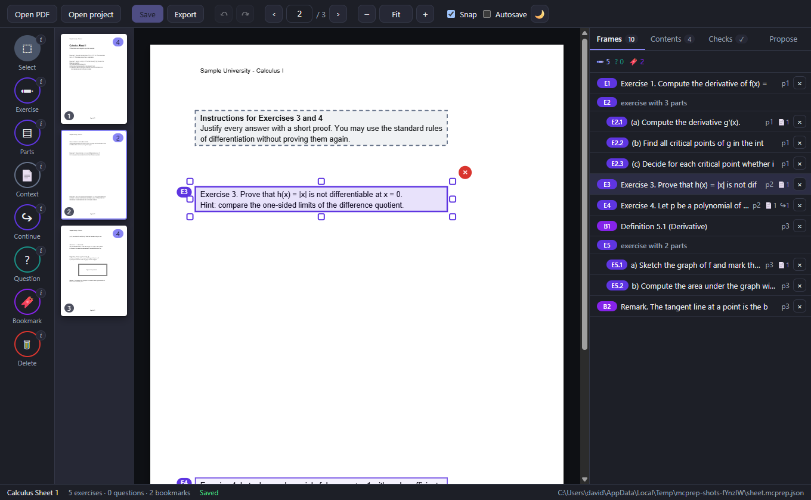

# The desktop app

The desktop app is a visual editor for the same **project file** (`<name>.mcprep.json`, see
[PROJECT_FILE.md](PROJECT_FILE.md)) that the command line and the MCP server edit. It uses the same code for every
change and every check, so what it saves is what `mcprep validate` accepts, and what an agent saves shows up in the
window within a second or two.

It is for a person who wants to look at the page while marking it, to review what an agent proposed, or to **audit a whole
book once as an authority**: its exercises with the numbers the book prints, filed under the sections of the book, with the
answers of the answer key attached as hidden solutions. Nothing about it is required: an agent can do the whole job with
[the command line](CLI.md) or [the MCP server](MCP.md).


## Start it

You need Node.js 20.19 or newer. From the repository:

```
npm ci
npm run build
npm run desktop                          # the welcome screen
npm run desktop -- C:\books\algebra.pdf  # opens the PDF; creates algebra.mcprep.json next to it if there is none
npm run desktop -- algebra.mcprep.json   # opens a project (a relative name is relative to the folder you typed it in)
```

You can also drop a PDF or a project file onto the window. Opening a PDF that already has a project next to it
(`<name>.mcprep.json`) opens that project.

Notes:

- `npm ci` installs Electron, whose install script downloads its program file (about 100 MB) from GitHub's release
  servers. That is the only network access of the whole toolset, and it happens at install time. Set
  `ELECTRON_SKIP_BINARY_DOWNLOAD=1` if you only want the command line and the MCP server.
- Some terminals (for example the one inside Visual Studio Code) set `ELECTRON_RUN_AS_NODE`, which makes Electron
  behave as plain Node so that the window never opens. `npm run desktop` removes the variable for you; if you start
  Electron yourself, remove it first.
- A second start hands its file to the window that is already open (one window, one document at a time).

## Working in the window

Top bar: **Open PDF**, **Open project**, **Save**, **Export**, **Document info**, undo and redo, the page pager, zoom (`Fit` fits
the page to the width of the window), **Snap**, **Autosave** and the theme (system, dark, light). Left: the tools. Next to them:
thumbnails with the number of frames on each page. Right: the card of the selected frame and the panels. Bottom: the title, the
counts, the save state and the project file.

Every tool has a small **i** next to it that says in one sentence what it does. A line above the page says what the tool in use
will do and, for the tools that attach something to an exercise, which exercise that is.

| Tool (key) | What it does |
| --- | --- |
| Select (V) | Click a frame to select it. Drag it to move it, drag a handle to resize it. The handles sit outside the outline. |
| Exercise (E) | Drag around one exercise you frame for yourself. A click on a line makes a one-line frame across the text block that line belongs to. |
| Book exercise (A) | Drag around one exercise as the book prints it, then give its printed number and its section (see below). |
| Parts (P) | Drag around an exercise with parts. It is cut where the markers `(a)`, `(b)`, `1.`, ... are found, else once in the middle. A click on an existing frame cuts it. Not for book exercises. |
| Context (C) | Select an exercise (of either kind), then drag around its instruction or shared statement, on any page. |
| Solution (L) | Select an exercise, go to the answer key (any page of the same PDF), then drag around its answer. Hidden from the learner. |
| Continue (N) | Select a frame, then drag where it goes on (the next column or page). |
| Question (Q) | Drag around what you want to ask the tutor about. |
| Bookmark (B) | Drag around a definition or theorem to keep. |
| Delete (Delete) | Deletes the selected frame. An exercise with parts goes as a whole. |

An **exercise with parts** is one object: you move and resize it as one. Its parts are cut by dashed **slicers**: drag a
slicer (or the part label at the right) to move the cut, press **+** below the exercise to cut another part, or **−**
at a slicer to join the two parts. The parts always tile the exercise exactly, so the checks cannot fail on a gap.

**Snap** makes the edges you draw or drag go to the nearest line of printed text (the same snapping as `--snap` on the
command line), so that a frame never cuts a line. It does not apply to scanned pages that have no text; there you place
the edges by eye.

The labels on the frames of exercises you framed yourself (E1, E2.1, B1, ...) are the numbers the Math Canvas app will show:
they are computed from the position on the page (never stored) and renumber themselves when you add or remove a frame.

Keys: `V E A P C L N Q B` choose a tool, `S` toggles snap, `Delete` removes the selected frame, `Esc` closes a dialog or a
form, leaves a tool, or deselects. `←` `→` (or `PageUp` `PageDown`) change the page, `+` `−` `0` zoom, `Ctrl+Z` undo, `Ctrl+Y` or
`Ctrl+Shift+Z` redo, `Ctrl+S` save, `Ctrl+E` export, `Ctrl+O` and `Ctrl+Shift+O` open a PDF or a project.

### Two kinds of exercise

- An **ordinary exercise** (tool Exercise, label `E1`, `E2.1`, ...) is one a person frames for themselves: free, positional
  numbers, it can be cut into parts.
- A **book exercise** (tool Book exercise, amber, a label with square corners) was audited from a book: it carries **the number
  the book prints** (`5`, `5a`, `A.3`) and the **section** it is printed in, it is a single exercise, and it never has a
  positional number. Both kinds can live in one project.

After you draw a book exercise a small form asks for its **printed number** and its **section**. The section offered is the one
at that place of the page (the deepest section of the outline that has an id and contains the position); the number offered is
the next one in that section: the previous one plus 1, or `5b` after `5a`. So auditing a section is: draw, press Enter, draw,
press Enter. The form says in plain words what is wrong (an empty or impossible number, a number the section already has, no
section here) and `Esc` throws the drawing away. Nothing is added to the project until the form is confirmed.

The **card** at the top of the side panel is the menu of the selected frame:

- the printed number and the section of a book exercise, editable (one undoable step each);
- **Make it a book exercise...** (the same form) and **Make it an ordinary exercise**, with the rules of the core: an exercise
  with parts has to be joined first (the card has **Join the parts**), a number a section already has is refused;
- its **context**, its hidden **solution** and its continuations: what is printed under each region, a button to show it on its
  page (it is marked for a moment) and a button to remove it;
- **Parts**: **Cut into parts** or **Join the parts** for an ordinary exercise; for a book exercise the button is off, with an
  **i** that says why (the parts `5a` and `5b` of a printed exercise are two exercises with two labels; what they share, the
  statement printed once, is context on each). The Parts tool says the same when you click a book exercise, and the core
  refuses `split`, `dividers`, `area` and `merge` for it anyway.

The core's messages are written for the command line; the window shows the rule in plain words (never a command to type).

### Solutions

A **solution** is a region of the same PDF, usually in the answer key at the back, that only the grader gets. Select the
exercise, choose the Solution tool, go to the answer key (the exercise stays selected while the page changes) and drag around its
answer. Solution regions are drawn **green and dashed with an `S` marker** and the number of the exercise, faintly for all
exercises and strongly for the selected one, whose regions have a button to remove them right there. Clicking a region selects its
exercise. The card lists them under "hidden from the learner" with what is printed under each; clicking one goes there. An exercise
may have up to eight regions of each kind. A solution is never shown with the exercise, never sent to a tutor chat, and used only
to grade (see [BUNDLE_FORMAT.md](BUNDLE_FORMAT.md)).

### The panels

- **Frames** lists every frame with its label, its first words, its page and icons for its context (📄), solution (🔑) and
  continuation (↪). Book exercises are **grouped by section** in the order of the book with the number the book prints, each group
  in the order a book counts (2 before 10, `5a` before `5b`); what you framed yourself follows in reading order. A filter picks
  **All**, **Book exercises** or **Framed by you**; the search finds a number (`5a`, `1.2:5a`) or a frame id; a click on a section
  folds it, `↗` goes to its heading, and a click on a row shows the frame on its page and scrolls it into view (also the other way:
  a frame chosen on the page is shown in the list). The list draws only the rows in view.
- **Sections** is the table of contents that goes into the bundle: the project's own, which are the sections book exercises are filed
  under. Each row shows the printed number, the title, the page, the id, the number of book exercises (own, and with everything
  below in brackets) and how many of them have a solution. A click goes to the heading; folding hides a subtree; a filter shows the
  sections still **without exercises**, with **exercises without a solution**, or **with problems**; the search finds a title, number
  or id. **Add a section** (after the selected one, or **a subsection**), and for the selected section: title, printed number, id,
  the page it starts on and where its heading is (type it, or **Pick the heading on the page** and click the line; the headings
  are marked on the page while the panel is open), **Outdent/Indent** and **Move up/down** (always with everything below it) and
  **Delete...** (the book exercises filed under it are moved to another section you choose first). Renaming an id takes the
  exercises along. The list warns about ids used twice, sections without an id (with **Give ids**), and book exercises filed under
  a section that does not exist. **Use the PDF's bookmarks** makes the PDF's own bookmarks the sections (with ids), **Derive
  sections** reads the whole book and finds its chapters and sections (see below), and **Use the PDF's contents** removes the
  project's own contents.
- **Checks** runs the same validation as `mcprep validate`. A click on a message goes to the frame it is about. The rules about
  books say what to do on the screen (not a command). A change that would add a new error is refused with a message that says why,
  like on the command line.
- **Propose** reads the printed text of the whole PDF **offline, without any AI**, and proposes. It has three modes. **Frames**
  suggests exercises, parts, context and bookmarks. They appear as dashed ghost frames with a confidence; the **i** next to each
  says what the suggestion is based on. Accept or reject one by one, or all at once. Nothing is changed until you accept. Accepted
  exercises with a shared statement get it as context of their parts, which is the recommended convention. Proposals are exercises
  you frame yourself; turn one into a book exercise from the card. **Book exercises** and **Solutions** find the numbered exercises
  of a book and the answers of its answer key (see below).







### Deriving the sections of a book

**Derive sections** (Sections panel) reads the whole book and finds its chapters and sections from the printed contents, the lists
on the chapter openers and the headings on the pages: each with an id (`c3` for a chapter, `3.2` for a section), the number the
book prints, title, page and the position of its heading, how sure the search is (a percentage) and the evidence (what each was
read from, where the sources disagree). It is the same search as `mcprep outline derive --book`. A bar says what it is doing and a
**Stop** button ends it; the window stays usable while the main process reads (a book of 500 pages takes a few seconds), and
opening another document stops it.

Nothing changes until you accept. The found sections replace the list for review, each compared by id with the sections the
project has: **New**, **Different** (the title, the page, the heading position, the level or the number differs, and how) or **The
same**. A click shows the evidence and goes to the heading, which is marked on the page (dashed, in the accent colour). New sections
are ticked, different ones are not: the project's own is kept unless you take the new version. **Accept all**, **Accept selected**
or **Discard**; taking is one undoable step, and a book that already has exactly these sections is reported as such.

An exercise names its section by id, so the sections it is filed under are never lost. A section of the project that holds
exercises and that the found list does not have (another id, or not taken) stays; the review lists these, and **Move exercises to
the same-looking sections** files their exercises under the found section with the same printed number or title (one by one, or
all at once) and lets the old one go. The found list replaces the project's own sections only when every section found is taken
(a section of yours without exercises that it does not have is then removed unless you ask to keep it); with a part of it, nothing
is removed.



### Finding the exercises and the answers of a book

**Propose → Book exercises** finds the numbered exercises of the practice sets of the sections the project has (they need ids and a
level below the chapters: derive them first), in all sections or in one (choose it, or press **Find its exercises** on the selected
section). **Propose → Solutions** finds the answers in the answer key at the back and matches each by section and number to an
exercise of the book (find the exercises first). It is the search of `mcprep exercises propose` and `solutions propose`, with the
window's own sections and exercises (saved or not), and the same progress bar and **Stop**.

Each proposal shows the number the book prints, its first line, how sure the search is and the evidence (its frame, the instruction
above it, the part on the next page). On the page, the proposals of the page that is showing are dashed ghosts: an exercise with
its printed number and its instruction as a dashed region, an answer as a dashed green region with an `S`; the one you look at has
**✓** (take it) and **✕** (dismiss it). Each is compared with the book: **New**, **Different** (the book's own frame or answer is
somewhere else; ticking it replaces the book's own) or **The same**. The list is filtered by state (new or different by default)
and by how sure the search is, and searched by number; a tick takes a proposal, **✕** dismisses it (it can be brought back from
the filter).

**Apply all** takes every new proposal the list shows, **Apply selected** the ticked ones (a different one only when ticked): one
atomic, undoable batch of the operations the command line writes (`add` with the printed number, the section and the instruction;
`solution.set`), validated as a whole and refused as a whole if it would add an error. A test applies one book both ways and
compares the operations and the frames. Run again, a book that has everything says so and offers nothing; one line says what was
applied. What is not a proposal is listed under **To look at**: numbers missing from a section, printed twice, lines that looked
like exercises and were left out, exercises of the book that the search did not find now, answers without an exercise, exercises
without an answer, and what cannot be applied (a number the bundle does not allow, an answer of more than eight regions).



### Document information

**Document info** sets what the bundle says about the work: the title and folder the library shows, the author, series,
description, **licence** (name and address), the **source address** and the **notice** a licence asks to be shown with the work.
The limits of the format are said next to each field (a licence address needs its name, an address starts with `http://` or
`https://`); copy the licence and the notice from the book itself, do not make them up. It is one undoable step.

### Saving and exporting

**Save** writes the project file atomically (a temporary file, then a rename) and checks the revision it read: if another
program saved in the meantime, nothing is overwritten (see below). **Autosave** saves a moment after each change; it is off
until you turn it on. A failed save stays visible in the status bar and in a message. Closing the window with unsaved
changes asks first.

**Export** (`Ctrl+E`) says what is about to be written before it is: the **optional parts of the format the bundle uses**
(Sections, Book exercises, Hidden solutions; an app that does not know one ignores it), what it contains (the exercises, questions
and bookmarks you framed, the book exercises per section and how many have a solution), the validation and its warnings. It lets
you choose which contents go into the bundle (the project's own, the PDF's bookmarks, or none; a project with book exercises
keeps its own, because they are filed under it), saves the project if needed, writes the `.mcbundle`, and runs the importer check
on the result before it says it worked, with the result of each of the importer's steps. Afterwards **Show in folder** opens
the folder and **Copy to a folder...** copies the bundle, for example into the folder the tablet imports from. **Export book summary
(JSON)...** next to **Export bundle...** writes the plain JSON summary of the book (the sections with the number of book exercises
and solutions in each, and each section's exercises) that `mcprep book export --exercises` writes, for other programs.





## Together with an agent

The window watches the project file. When a program such as `mcprep` or an MCP client saves a new version:

- without unsaved edits in the window: the page updates, a short message says what changed ("Updated by cli: 1 added"),
  and a small marker in the status bar fades over twenty seconds. The page and the zoom stay as they are, and so does the
  selection if its frame still exists; the undo history starts over, because it belonged to the old version;
- with unsaved edits: a dialog asks whether to **keep mine** (the next save replaces the other version) or **take theirs**.
  Nothing is merged silently.

An agent that edits the file while the window is open therefore needs no special care: it can work through the command
line as usual, and the person sees the result and can correct it by hand. The window compares the content as well as the
revision, so a change made with a text editor that did not raise the revision is noticed too. A book exercise that has been drawn
but not yet confirmed in its form is not in the file; it is dropped when the page changes.



## A big book

A book can have thousands of exercises (two-column practice pages carry 44 small frames on one page) and hundreds of sections. The
window keeps what it computes per version of the project (the lookups of the frames, the sections with their counts, the checks)
instead of per keystroke, draws only the frames of the page that shows, makes the labels as tall as their frames allow and puts
each in the free space beside its frame (hovering a frame, or selecting it, enlarges its label), and keeps the lists to the rows in
view. The text of the pages is read in the background and checked once, not after every few pages. The selected frame's handles
sit under its neighbours, so that a click on a neighbour selects the neighbour.

`apps/desktop/test/helpers/big-book.ts` builds a synthetic workbook of 5,000 book exercises, 100 sections and an answer key of
5,000 regions. On the Windows machine it was developed on, the built window shows it about a second after the program starts, has
read the text of all 135 pages a second or two later, and then takes a fraction of a second for each of: choosing a frame in the
list, drawing a book exercise and confirming its form, saving, and taking over a change the command line made. While the list was
scrolled five times, a frame chosen in it and thirty pages turned, the window was never busy for more than about a tenth of a second.
The proposals of such a book are as quick: with the 5,000 exercises (and 5,000 answers) found, the list opens in a few dozen
milliseconds, a search in it takes a few dozen, and applying them as one step takes about a fifth of a second (the answers about half
a second); the window's timers were never late by more than a few milliseconds. Reading a book of 2,150 pages for the sections takes
about three seconds in the main process, and the window answered all the time. The tests assert generous limits (a slow or busy
machine), not these numbers.

## What the window can and cannot do

The window is built so that opening a document you did not write is safe, and so that nothing leaves the computer:

- The page code has **no Node access** (sandbox, context isolation, no integration). The only bridge to the rest of the
  system is a fixed list of 22 functions (open, read the PDF of the open project, read the text of a page, propose, derive the
  sections, find the exercises or the answers of a book, stop that search and hear its progress, save, export the bundle, export
  the book summary, ...); the test suite checks the list.
- It is served from the application folder under its own `mcprep-app://` address with a strict content policy
  (`default-src 'none'`, no inline script, no network). Every request to `http`, `https`, `ws`, `wss` or `ftp` is cancelled.
  Permission requests are denied. Navigation and new windows are blocked. The developer tools exist only in a checkout,
  not in the packaged application.
- There is no telemetry, no update check, no account, no AI call. The PDF is read from where it is; the only copies that are ever
  made are the one inside a bundle you export (and the one you copy to a folder yourself) and the summary file you ask for.
- It stores a list of the twelve most recent projects (title and path; one that no longer exists is not offered) in the
  operating system's user-data folder for the application, and the preferences (theme, snap, autosave) in the window's local
  storage. Nothing else.

## Package it

```
npm run build
npm run pack --workspace @mcprep/desktop   # apps/desktop/release/win-unpacked: a folder to try without installing
npm run dist                               # builds, then also the installer: apps/desktop/release/Math Canvas Prep Setup 0.2.0.exe
```

The output is about 450 MB unpacked and a 133 MB installer, because it contains the Chromium of Electron; it is
git-ignored. electron-builder downloads Electron's runtime from GitHub the first time (it keeps a cache). The configuration is
[`apps/desktop/electron-builder.yml`](../apps/desktop/electron-builder.yml). The build is **unsigned** (this repository has
no certificate), has Electron's default icon, and publishes nothing. Windows will warn about an unknown publisher.
macOS and Linux targets are written down in the configuration but have not been built or tested.

## Tests

- `apps/desktop/test/*.test.ts` (187 tests, no window needed, they run with `npm test`): `logic.test.ts` the editor's state,
  geometry, undo, saving, conflicts, proposals; `book.test.ts` printed numbers, the form's suggestions, the two kinds of exercise,
  solutions and the plain words of the core's refusals, labels on a crowded page; `sections.test.ts` the rows of the Sections list
  and every change of the outline; `info.test.ts` the document information and what the export dialog says; `derive.test.ts` what
  is new, different or the same, what taking the derived sections does (and that no exercise is ever left without its section),
  and the flow of progress, Stop and review; `proposals.test.ts` the rows, filters, findings and the batch of the exercises and
  answers found in a book, with a test that applies one book through the window's code and through the command line and compares
  the operations and the frames; `audit.test.ts` the long jobs of the main process (progress, Stop, one at a time, stopped by
  closing the document); `perf.test.ts` the synthetic big book (5,000 exercises, 100 sections): the work of the lists, the page,
  the store and the proposals, and that it grows in step with the book.
- `apps/desktop/test/app.e2e.test.ts` (17 tests), `book.e2e.test.ts` (25), `derive.e2e.test.ts` (12), `proposals.e2e.test.ts` (12)
  and `big.e2e.test.ts` (10): the built application driven by Playwright like a person (real mouse and keyboard): drawing with
  snapping, moving, resizing, slicers, saving, an agent editing the file, the conflict dialog, export and import check, proposals,
  the lock-down; the audit of a synthetic workbook (book exercises with their forms, mark and unmark, context and solutions, the
  Sections list, the document information, the export dialog and the summary, all read back by the command line); deriving the
  sections and finding the exercises and answers of a synthetic textbook through the main process, with progress, Stop and the
  window staying responsive on a book of 2,150 pages; the window with the proposals of 5,000 exercises; and the big book (opening,
  scrolling, choosing, drawing, saving, live reload, readable labels). They need a display and the built bundle, so they are not
  part of the continuous integration: `npm run build && npm run test:e2e`.
- `npm run screenshots --workspace @mcprep/desktop` takes the pictures on this page from the synthetic samples.

## Known gaps

- Mouse and keyboard first. Touch and pen input are not tuned, and the window is not meant for a small screen.
- One window and one document at a time; no copy and paste of frames; no selecting several frames at once (so turning many
  exercises into book exercises, or giving many the same context or section, is one at a time).
- Derive sections and the proposals of exercises and answers are the heuristics of the command line with their limits (see
  [AUDIT_A_BOOK.md](AUDIT_A_BOOK.md)). A book printed in another way needs the words and patterns the command line takes
  (`--chapter-words`, `--practice-words`, `--answer-words`, `--item-pattern`), which the window does not offer. A proposal is taken
  or dismissed, not edited: edit it after taking it, with the tools. The search for exercises needs sections with ids below the
  chapters; an outline of one level finds no practice set. One long search at a time.
- The number offered for a book exercise is the previous one plus 1 (or `5b` after `5a`); it does not know a book's jumps or
  other ways of counting, so it is edited where the book differs.
- A solution region is drawn one at a time for one exercise; there is no "this answer, then the next line for the next exercise".
- The tree of sections is changed with buttons (deeper, shallower, up, down); there is no drag and drop.
- A frame lies on one page; something that continues is marked with a continuation, as in the format.
- The installer does not register `.pdf` or `.mcprep.json` with the system, and has no icon of its own.
- Scanned pages have no text to snap to or to propose from; frames are placed by hand (see the
  [agent guide](AGENT_GUIDE.md) for how an agent reads scans).
- Only Windows was packaged and run. The editor itself has no Windows-only code, but it was not tried elsewhere.
