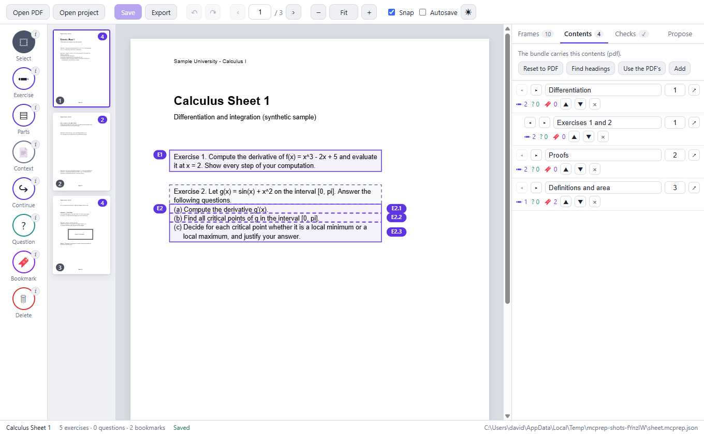

# The desktop app

The desktop app is a visual editor for the same **project file** (`<name>.mcprep.json`, see
[PROJECT_FILE.md](PROJECT_FILE.md)) that the command line and the MCP server edit. It uses the same code for every
change and every check, so what it saves is what `mcprep validate` accepts, and what an agent saves shows up in the
window within a second or two.

It is for a person who wants to look at the page while marking it, or to review what an agent proposed. Nothing
about it is required: an agent can do the whole job with [the command line](CLI.md) or [the MCP server](MCP.md).


## Start it

You need Node.js 20.19 or newer. From the repository:

```
npm ci
npm run build
npm run desktop                          # the welcome screen
npm run desktop -- C:\books\algebra.pdf  # opens the PDF; creates algebra.mcprep.json next to it if there is none
npm run desktop -- algebra.mcprep.json   # opens a project (a relative name is relative to the folder you typed it in)
```

You can also drop a PDF or a project file onto the window. Opening a PDF that already has a project next to it
(`<name>.mcprep.json`) opens that project.

Notes:

- `npm ci` installs Electron, whose install script downloads its program file (about 100 MB) from GitHub's release
  servers. That is the only network access of the whole toolset, and it happens at install time. Set
  `ELECTRON_SKIP_BINARY_DOWNLOAD=1` if you only want the command line and the MCP server.
- Some terminals (for example the one inside Visual Studio Code) set `ELECTRON_RUN_AS_NODE`, which makes Electron
  behave as plain Node so that the window never opens. `npm run desktop` removes the variable for you; if you start
  Electron yourself, remove it first.
- A second start hands its file to the window that is already open (one window, one document at a time).

## Working in the window

Top bar: **Open PDF**, **Open project**, **Save**, **Export**, undo and redo, the page pager, zoom (`Fit` fits the page to
the width of the window), **Snap**, **Autosave** and the theme (system, dark, light). Left: the tools. Next to them: thumbnails with
the number of frames on each page. Right: the panels. Bottom: the title, the counts, the save state and the project file.

Every tool has a small **i** next to it that says in one sentence what it does.

| Tool (key) | What it does |
| --- | --- |
| Select (V) | Click a frame to select it. Drag it to move it, drag a handle to resize it. The handles sit outside the outline. |
| Exercise (E) | Drag around one exercise. A click on a line makes a one-line frame across the text block that line belongs to. |
| Parts (P) | Drag around an exercise with parts. It is cut where the markers `(a)`, `(b)`, `1.`, ... are found, else once in the middle. A click on an existing frame cuts it. |
| Context (C) | Select an exercise, then drag around its instruction or shared statement. |
| Continue (N) | Select a frame, then drag where it goes on (the next column or page). |
| Question (Q) | Drag around what you want to ask the tutor about. |
| Bookmark (B) | Drag around a definition or theorem to keep. |
| Delete (Delete) | Deletes the selected frame. An exercise with parts goes as a whole. |

An **exercise with parts** is one object: you move and resize it as one. Its parts are cut by dashed **slicers**: drag a
slicer (or the part label at the right) to move the cut, press **+** below the exercise to cut another part, or **−**
at a slicer to join the two parts. The parts always tile the exercise exactly, so the checks cannot fail on a gap.

**Snap** makes the edges you draw or drag go to the nearest line of printed text (the same snapping as `--snap` on the
command line), so that a frame never cuts a line. It does not apply to scanned pages that have no text; there you place
the edges by eye.

The labels on the frames (E1, E2.1, B1, ...) are the numbers the Math Canvas app will show: they are computed from the
position on the page (never stored) and renumber themselves when you add or remove a frame.

Keys: `V E P C N Q B` choose a tool, `S` toggles snap, `Delete` removes the selected frame, `Esc` closes a dialog, leaves
a tool, or deselects. `←` `→` (or `PageUp` `PageDown`) change the page, `+` `−` `0` zoom, `Ctrl+Z` undo, `Ctrl+Y` or
`Ctrl+Shift+Z` redo, `Ctrl+S` save, `Ctrl+E` export, `Ctrl+O` and `Ctrl+Shift+O` open a PDF or a project.

### The panels

- **Frames** lists every frame in reading order with its label, its first words, its page and its context and
  continuation markers. A click shows the page and scrolls the frame into view.
- **Contents** is the table of contents that goes into the bundle: the project's own, or else the PDF's bookmarks. You can
  copy the PDF's bookmarks to edit them, ask for headings found in the text (**Find headings**, offline), then rename,
  indent, move, retarget or remove entries. Every entry shows how many exercises, questions and bookmarks it holds.
- **Checks** runs the same validation as `mcprep validate`. A click on a message goes to the frame it is about.
  A change that would add a new error is refused with a message that says why, like on the command line.
- **Propose** reads the printed text of the whole PDF **offline, without any AI**, and suggests exercises, parts,
  context and bookmarks. They appear as dashed ghost frames with a confidence; the **i** next to each says what the
  suggestion is based on. Accept or reject one by one, or all at once. Nothing is changed until you accept. Accepted
  exercises with a shared statement get it as context of their parts, which is the recommended convention.




### Saving and exporting

**Save** writes the project file atomically (a temporary file, then a rename) and checks the revision it read: if another
program saved in the meantime, nothing is overwritten (see below). **Autosave** saves a moment after each change; it is off
until you turn it on. A failed save stays visible in the status bar and in a message. Closing the window with unsaved
changes asks first.

**Export** (`Ctrl+E`) shows the validation first. It lets you choose which contents go into the bundle (the project's own,
the PDF's bookmarks, or none), saves the project if needed, writes the `.mcbundle`, and runs the importer check on the
result before it says it worked. Afterwards **Show in folder** opens the folder and **Copy to a folder...** copies the
bundle, for example into the folder the tablet imports from.


## Together with an agent

The window watches the project file. When a program such as `mcprep` or an MCP client saves a new version:

- without unsaved edits in the window: the page updates, a short message says what changed ("Updated by cli: 1 added"),
  and a small marker in the status bar fades over twenty seconds. The page and the zoom stay as they are, and so does the
  selection if its frame still exists; the undo history starts over, because it belonged to the old version;
- with unsaved edits: a dialog asks whether to **keep mine** (the next save replaces the other version) or **take theirs**.
  Nothing is merged silently.

An agent that edits the file while the window is open therefore needs no special care: it can work through the command
line as usual, and the person sees the result and can correct it by hand.


## What the window can and cannot do

The window is built so that opening a document you did not write is safe, and so that nothing leaves the computer:

- The page code has **no Node access** (sandbox, context isolation, no integration). The only bridge to the rest of the
  system is a fixed list of 18 functions (open, read the PDF of the open project, read the text of a page, propose,
  save, export, ...); the test suite checks the list.
- It is served from the application folder under its own `mcprep-app://` address with a strict content policy
  (`default-src 'none'`, no inline script, no network). Every request to `http`, `https`, `ws`, `wss` or `ftp` is cancelled.
  Permission requests are denied. Navigation and new windows are blocked. The developer tools exist only in a checkout,
  not in the packaged application.
- There is no telemetry, no update check, no account, no AI call. The PDF is read from where it is; a copy of it is never made
  or sent.
- It stores a list of the twelve most recent projects (title and path) in the operating system's user-data folder for the
  application, and the preferences (theme, snap, autosave) in the window's local storage. Nothing else.

## Package it

```
npm run build
npm run pack --workspace @mcprep/desktop   # apps/desktop/release/win-unpacked: a folder to try without installing
npm run dist                               # builds, then also the installer: apps/desktop/release/Math Canvas Prep Setup 0.1.0.exe
```

The output is about 450 MB unpacked and a 133 MB installer, because it contains the Chromium of Electron; it is
git-ignored. The configuration is
[`apps/desktop/electron-builder.yml`](../apps/desktop/electron-builder.yml). The build is **unsigned** (this repository has
no certificate), has Electron's default icon, and publishes nothing. Windows will warn about an unknown publisher.
macOS and Linux targets are written down in the configuration but have not been built or tested.

## Tests

- `apps/desktop/test/logic.test.ts` (26 tests): the editor's state, geometry, undo, saving, conflicts, proposals,
  contents; no window needed. It runs with `npm test`.
- `apps/desktop/test/app.e2e.test.ts` (15 tests): the built application driven by Playwright like a person (real mouse and
  keyboard): drawing with snapping, moving, resizing, slicers, saving, an agent editing the file, the conflict dialog,
  export and import check, proposals, the lock-down. It needs a display and the built bundle, so it is not part of the
  continuous integration: `npm run build && npm run test:e2e`.
- `npm run screenshots --workspace @mcprep/desktop` takes the pictures on this page from the synthetic sample.

## Known gaps

- Mouse and keyboard first. Touch and pen input are not tuned, and the window is not meant for a small screen.
- One window and one document at a time; no copy and paste of frames; no selecting several frames at once.
- A frame lies on one page; something that continues is marked with a continuation, as in the format.
- The installer does not register `.pdf` or `.mcprep.json` with the system, and has no icon of its own.
- Scanned pages have no text to snap to or to propose from; frames are placed by hand (see the
  [agent guide](AGENT_GUIDE.md) for how an agent reads scans).
- Only Windows was packaged and run. The editor itself has no Windows-only code, but it was not tried elsewhere.
